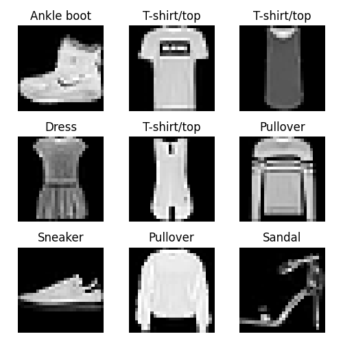
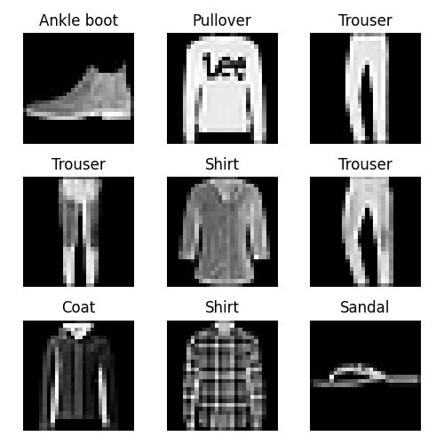
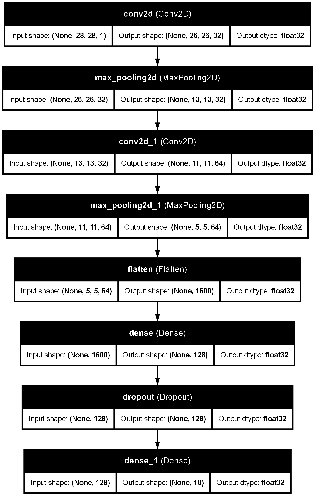
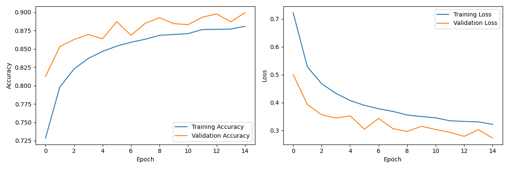
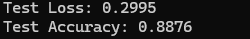
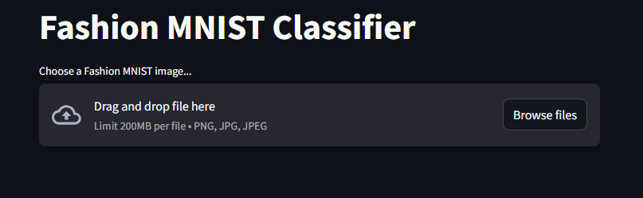
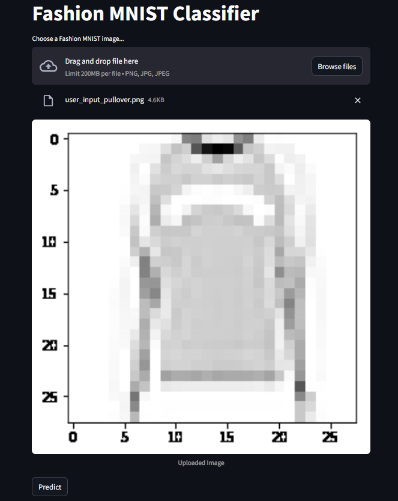
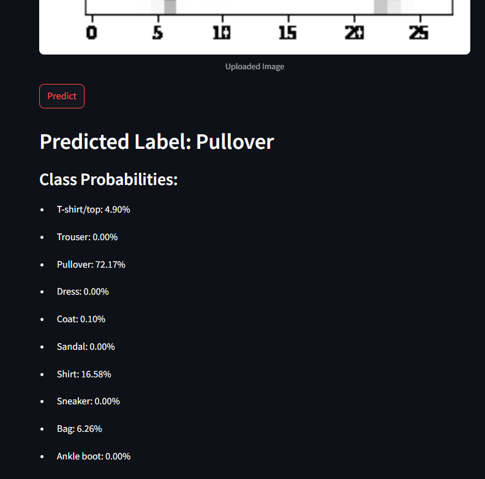

# Fashion MNIST Classifier

This project is a learning project aimed at building a fashion item image classifier using a Convolutional Neural Network (CNN) and deploying it as a Streamlit web application. First, Aritificial Neural Network was build. Later, it went to some upgradation. Then, finally we implemented CNN, which provides accuracy of about 89-90%.

## Table of Contents

*   [Project Overview](#project-overview)
*   [Project Structure](#project-structure)
*   [File Explanations](#file-explanations)
*   [Data](#data)
*   [Model Architecture](#model-architecture)
*   [Training and Evaluation](#training-and-evaluation)
*   [Streamlit App](#streamlit-app)
*   [Libraries Used](#libraries-used)
*   [Cloning the Repository](#cloning-the-repository)

## Project Overview

The project utilizes the Fashion MNIST dataset, which consists of 70,000 grayscale images of 28x28 pixels each, representing 10 different categories of clothing. We train a CNN model to recognize these categories and then create a Streamlit app to make the model accessible through a web interface.

## Project Structure

The project directory (`mnist_fashion`) is organized as follows:

```
mnist_fashion/
├── images/
│   ├── cnn_model_architecture.png       # CNN model architecture diagram
│   ├── cnn_history_simpler_model.png  # Training history plot
│   ├── cnn_model_test_evaluation.png   # Test set evaluation results
│   ├── train_samples.png              # Sample training images
│   ├── test_samples.png               # Sample test images
│   ├── streamlit_app_home.png       # Streamlit app - home page
│   ├── streamlit_app_input_uploaded.png # Streamlit app - image upload
│   └── streamlit_app_fashion_recognition.png # Streamlit app - recognition result
|   |-- .....
├── app.py                             # Streamlit web application
├── train.py                           # Model training script
├── cnn_fashion_mnist_model.keras      # Saved CNN model (newer format)
├── cnn_model.py                       # CNN model definition
├── evaluate.py                        # Model evaluation script
├── fashion_mnist_model.keras          # Saved CNN model (older format - if applicable)
├── Readme.md                          # This file
├── utils.py                           # Utility functions (data loading, preprocessing)
└── plot_images.py                     # Script for plotting sample images
```

## File Explanations

*   `app.py`: Contains the Streamlit application code, allowing users to interact with the trained model through a web interface.
*   `train.py`: The script used to train the CNN model. It includes data loading, preprocessing, model definition, training, and saving.
*   `cnn_fashion_mnist_model.keras`: The saved CNN model in the newer Keras format.
*   `cnn_model.py`: Defines the architecture of the CNN model.
*   `evaluate.py`: Script for evaluating the saved model on the test dataset.
*   `fashion_mnist_model.keras`: The saved ANN model..
*   `Readme.md`: This file, providing information about the project.
*   `utils.py`: Contains utility functions for data loading, preprocessing, and other helper functions.
*   `plot_images.py`: Script used to generate sample images from the dataset for visualization.
*   `images/`: Directory containing images related to the project (model architecture, training history, sample images, Streamlit app screenshots).

## Data

The Fashion MNIST dataset is used. Sample images from the training and test sets are available in the `images/` directory:

*  Sample training images.



*  Sample test images.



## Model Architecture

The CNN model architecture is defined in `cnn_model.py` and visualized in:

*  Diagram of the CNN model architecture.



## Training and Evaluation

The model is trained using `train.py` and evaluated using `evaluate.py`. The training history and test set evaluation results are saved as:

*  Plot of training and validation accuracy/loss over epochs


  
*  Results of evaluating the model on the test set



## Streamlit App

The Streamlit app (`app.py`) allows users to upload images and get predictions from the trained model. Screenshots of the app are in the `images/` directory:

*   Streamlit app - home page.


  
*   Streamlit app - image upload.



* Streamlit app - recognition result.



## Libraries Used

This project uses the following libraries:

*   **TensorFlow/Keras:** For building and training the CNN model.  Install with: `pip install tensorflow`
*   **NumPy:** For numerical operations. Install with: `pip install numpy`
*   **Matplotlib:** For plotting graphs and images. Install with: `pip install matplotlib`
*   **Scikit-learn:** For data splitting (`train_test_split`). Install with: `pip install scikit-learn`
*   **Pillow (PIL):** For image processing in the Streamlit app. Install with: `pip install Pillow`
*   **Streamlit:** For creating the web application. Install with: `pip install streamlit`
*   **Graphviz:** Used by Keras' `plot_model` utility to visualize the model architecture. Install it separately based on your OS (e.g., `apt-get install graphviz` on Debian/Ubuntu, `brew install graphviz` on macOS).  `pip install graphviz` installs the Python bindings.  You need both the Graphviz engine and the Python package.

### Or simply use the below code:
```bash
pip install -r requirements.txt
```

## Cloning the Repository

To clone this repository, use the following command:

```bash
git clone https://github.com/UmerSalimKhan/MNIST-Fashion-Recognition.git
```
